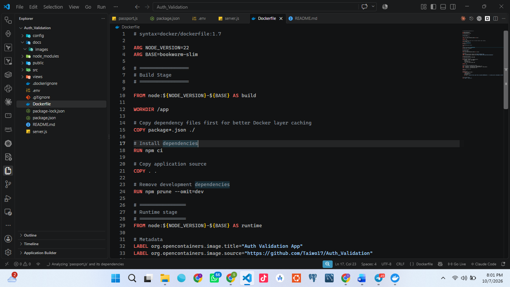
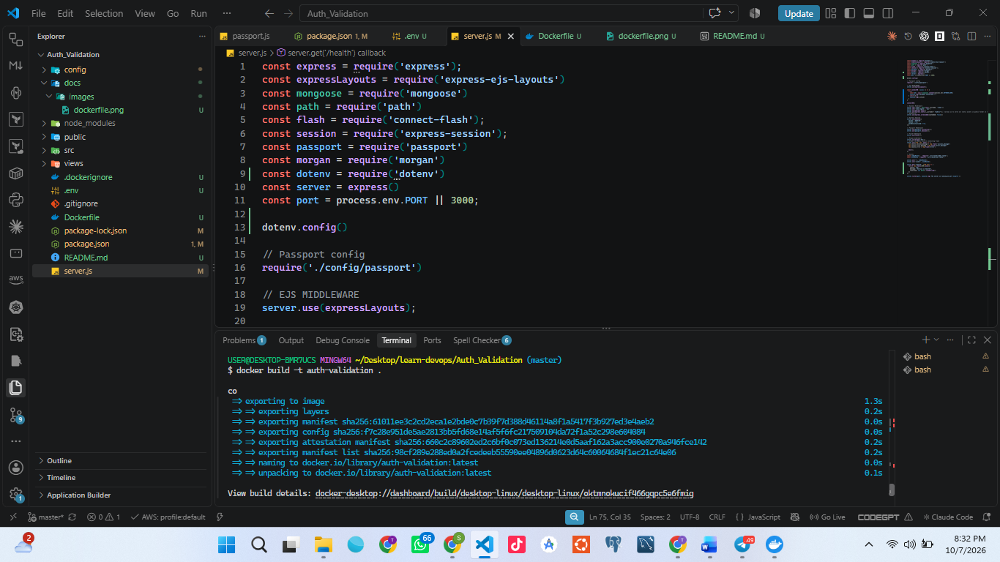
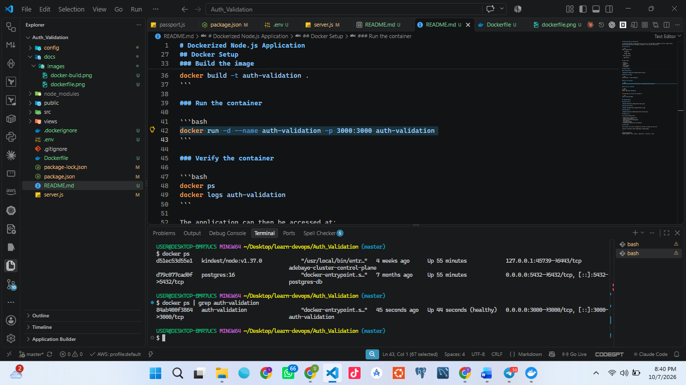
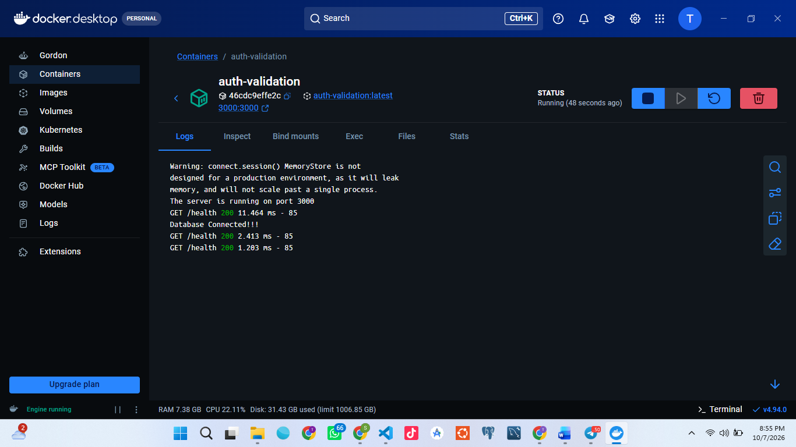
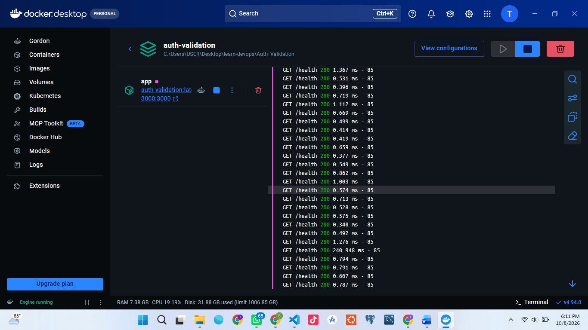
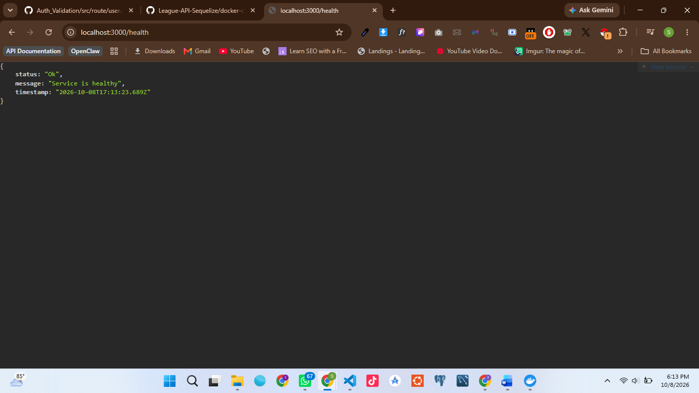
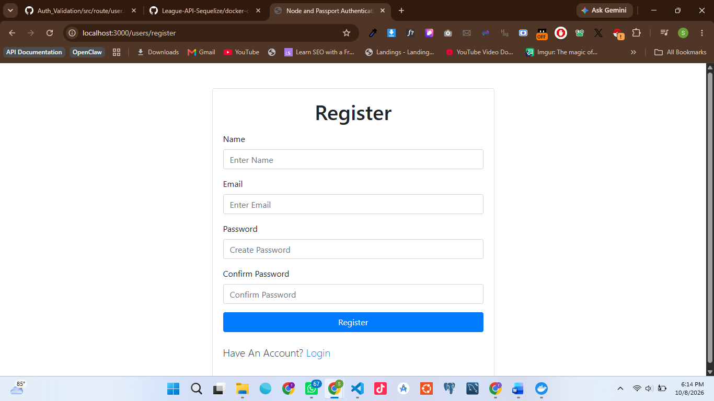
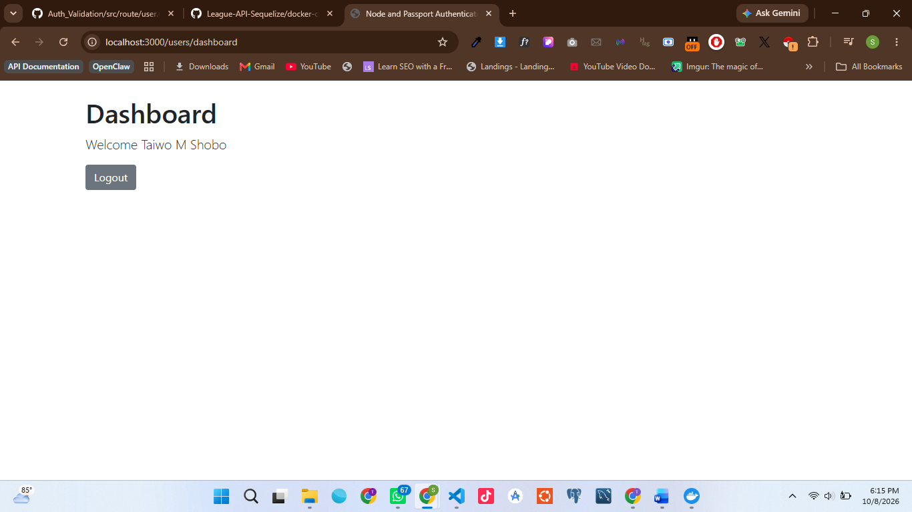

# Dockerized Node.js Application

A containerized Node.js application built as part of my **30 Days of DevOps** journey, demonstrating Docker-based application packaging, deployment, and runtime verification.

## Architecture

```text
Node.js Application
        ↓
    Dockerfile
        ↓
    Docker Image
        ↓
 Docker Container
        ↓
   Application
```

## Tech Stack

- Node.js
- JavaScript
- Docker
- Git & GitHub
- Linux/Bash

## Docker Setup

### The Dockerfile



### Build the image

```bash
docker build -t auth-validation .
```

### Run the container

```bash
docker run -d --name auth-validation -p 3000:3000 --env-file .env auth-validation
```

### Verify the container

```bash
docker ps
docker logs auth-validation
```

The application can then be accessed at:

```text
http://localhost:3000
```

## Implementation

### Docker Build



### Running Container



### Application



## DevOps Focus

This project demonstrates:

- Application containerization
- Docker image creation
- Container lifecycle management
- Port mapping
- Container logging
- Reproducible application environments

## Next Steps

This project will evolve throughout my 30 Days of DevOps journey with:

**CI/CD → Terraform → AWS → Kubernetes → Monitoring**

---

Yes. I’ll make it concise and combine **everything we actually did on Day 2**, including the problems we encountered, fixes, Docker work, authentication, and screenshot placeholders.

Since the file-generation tool is currently unavailable, I can give you the complete `.md` content now, and you can save it as `DAY_2.md`.

# 30 Days of DevOps — Day 2

## Dockerized Node.js Authentication & MongoDB Atlas

Today I continued working on my **Node.js authentication project**, focusing on authentication, Docker, MongoDB Atlas, debugging, and making the application more production-ready.

### 🛠️ What I Worked On

* Connected the Node.js application to **MongoDB Atlas** instead of using a local MongoDB container.
* Updated Docker Compose to build the application from the Dockerfile.
* Configured Passport authentication using:

  * `passport`
  * `passport-local`
  * `bcryptjs`
* Removed `passport-local-mongoose` from the authentication architecture.
* Implemented user registration with password hashing.
* Implemented login using Passport Local Strategy.
* Added session-based authentication.
* Added a protected `/dashboard` route.
* Added logout functionality.
* Added and tested the `/health` endpoint.
* Added a Docker `HEALTHCHECK`.

---

##  Problems I Encountered

### 1. Passport Error

I encountered:

```text
TypeError: next is not a function
```

The error was coming from `passport-local-mongoose`.

Instead of continuing with the plugin, I simplified the authentication architecture by using:

```text
Passport
   ↓
passport-local
   ↓
bcryptjs
   ↓
Mongoose
```

This gives the application more explicit control over password hashing and authentication.

---

### 2. Docker Was Running Old Code

One of the most important discoveries was that my host machine had the updated code, but the running Docker container still contained the old authentication dependency.

I checked the actual container with:

```bash
docker compose exec app sh -c "cat package.json | grep passport"
```

and found:

```text
passport
passport-local
passport-local-mongoose
```

I then searched the container:

```bash
docker compose exec app sh -c "grep -R 'passport-local-mongoose' /app --exclude-dir=node_modules"
```

This showed that the container was still using the old source code.

### Fix

My Compose configuration only had:

```yaml
image: ${DOCKER_IMAGE_NAME}
```

so I added:

```yaml
build:
  context: .
  dockerfile: Dockerfile
```

Then rebuilt the application:

```bash
docker compose down --remove-orphans
docker compose build --no-cache app
docker compose up -d
```

This ensured the running container contained the latest application code and dependencies.

---

##  Authentication Flow

The authentication flow is now:

```text
Register
   ↓
Validate input
   ↓
Hash password with bcrypt
   ↓
Save user to MongoDB Atlas
   ↓
Login
   ↓
Passport Local Strategy
   ↓
Verify password
   ↓
Create session
   ↓
Dashboard
```

Passwords are hashed before being stored:

```js
const hashedPassword = await bcrypt.hash(password, 10);
```

And verified during login:

```js
const isMatch = await bcrypt.compare(password, user.password);
```

---

##  Logout

I also added Passport logout functionality:

```js
router.get('/logout', (req, res, next) => {
    req.logout((err) => {
        if (err) return next(err);

        req.session.destroy((err) => {
            if (err) return next(err);

            res.redirect('/users/login');
        });
    });
});
```

---

##  Protected Dashboard

I encountered:

```text
Cannot GET /dashboard
```

The application was running, but Express did not have a route for `/dashboard`.

I added the dashboard route and protected it so unauthenticated users are redirected to login.

```js
router.get('/dashboard', (req, res) => {
    if (!req.isAuthenticated()) {
        return res.redirect('/users/login');
    }

    res.render('dashboard', {
        user: req.user
    });
});
```

---

##  Health Check

The application has:

```text
GET /health
```

which allows me to verify that the application is running.

Docker also checks the endpoint using:

```dockerfile
HEALTHCHECK --interval=30s \
    --timeout=3s \
    --start-period=5s \
    --retries=3 \
    CMD node -e "require('http').get('http://localhost:3000/health', r => process.exit(r.statusCode === 200 ? 0 : 1)).on('error', () => process.exit(1))"
```

---

##  Screenshots

Add screenshots from the actual project in this section.

### Docker Containers





### Health Check




### Login / Registration





### Dashboard




---

## Key DevOps Lesson

The biggest lesson today was:

> **Don't assume that the code on your machine is the code running inside your container.**

When debugging Docker applications, I learned to inspect the actual running container using:

```bash
docker compose exec app sh
```

and verify its files, dependencies, environment, and processes.

---

##  Day 2 Completed

* [x] MongoDB Atlas integration
* [x] Docker Compose configuration
* [x] Docker image rebuild
* [x] Passport authentication
* [x] Password hashing with bcrypt
* [x] Registration
* [x] Login
* [x] Sessions
* [x] Protected dashboard
* [x] Logout
* [x] Health endpoint
* [x] Docker health check
* [x] Container debugging

### 🚀 Next — Day 3

Next, I'll focus on **production hardening, security, logging, CI/CD, and improving the Docker deployment workflow.**

#DevOps #Docker #NodeJS #MongoDB #MongoDBAtlas #PassportJS #JavaScript #CloudComputing #DevOpsJourney


**Shobo Adefowope**
DevOps Engineer | AWS | Docker | Kubernetes | Terraform | CI/CD
